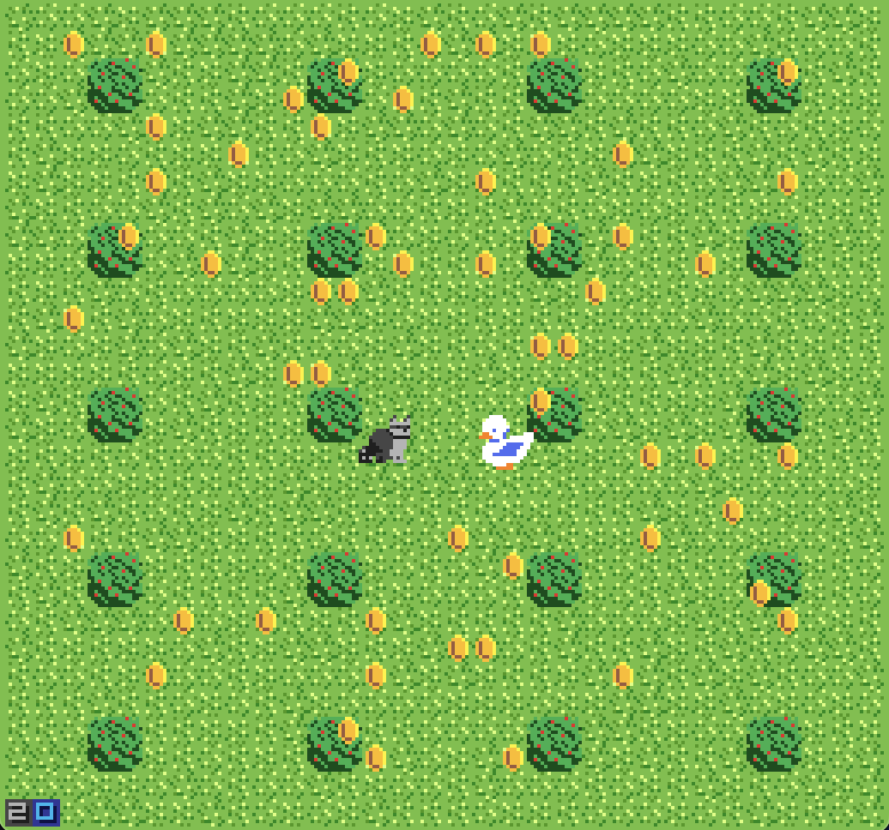

# what the duck!!

Author: Sarah Di (sarahdi)

Design: This game builds off of battleship. Like battleship, the raccoon has to deduce which bush the duck is hiding in at the end of each game increment. Where this game differs from battleship is the objective of the duck, which is not to attack the raccoon but rather to collect as many coins as possible (because ducks like shiny things). Unlike in battleship where you have an indication of hits and misses, the raccoon can only deduce the ducks location from the location of the coins, and the game gets harder for the raccoon the longer it progresses.

Screen Shot:

## How Your Asset Pipeline Works:

I created the source files using a combination of GIMP (early on) and http://pixilart.com (online pixel art tool). 
My asset pipeline utilizes the load_png function to load in these tiles as vectors of glm:u8vec4 colors. I also have a 4x8 png file called palettes.png, which I use to hold all of the palettes I use in the game. I did this because I found it hard to preserve the order to colors should tiles that share the same palette have a different ordering of the colors. 

I first load the palettes into a really large map containing all possible palette colors. The key is a u8vec4 of the rgba value, while the value is an 8bit index that contains the palette index and the 2-bit index of the palette. There are some issues with this design which I comment on in the asset_pipeline.cpp, but overall since I don't need this method to work exhaustively for all possible palettes (only the ones I need for the game), I find this to work good enough.

Afterwards I load in sprites first and then other assets. There is no particular reason for this order, but manually reading the tiles in ensures I know which index to call when loading them onto the ppu. For each tile, I call load_png, and iterate through every colored pixel in the tile. Using the palettes map created earlier, I then obtain the 2-bit index for the pixel in relation to the tile's palette and am able to update the bits for that location.

My source files are located in the [assets](/assets/) folder. My sprites (duck and raccoon) are located in a subfolder of assets called [sprites](/assets/sprites/). All other tiles (grass, bushes, coins, numbers) are found under the [tiles](/assets/tiles/) subfolder. 

## Game Premise

The raccoon and duck are natural enemies. The game is divided up into 10 second increments. Within each increment the raccoon and duck take turns scouring the map. The goal of the duck is to collect all of the coins on the map without getting caught. The goal of the raccoon is to catch the duck. The game ends when either the duck is found by the raccoon or if the duck collects all of the coins.

## How To Play:

This is a two player game. First decide who wants to be the raccoon and who wants to be the duck.

Raccoon: Move around using the WASD keys. Shoot using E.

Duck: Move around using the arrow keys. Hide using the right shift button. Unhide using the forward slash button.

## This game was built with [NEST](NEST.md).

